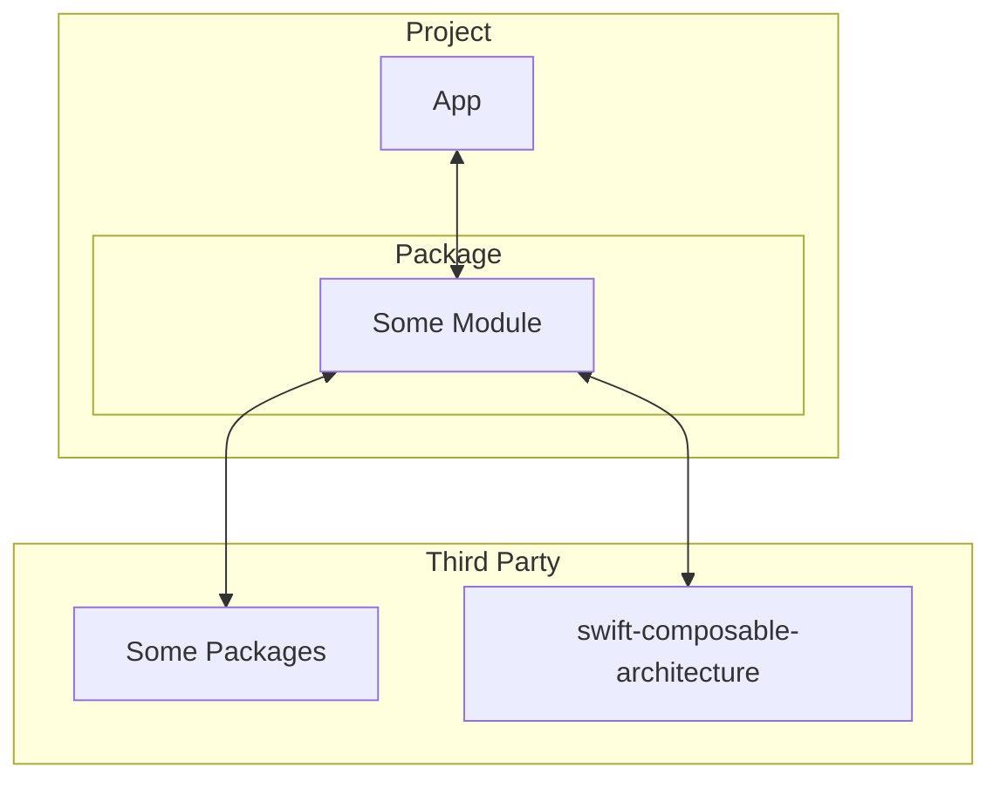

# c-search-tca
🏢 This is an app to search corporate info

## Goal
Experiment with an **engaging approach** for iOS app development
[The Composable Architecture](https://github.com/pointfreeco/swift-composable-architecture)

## Dependencies

